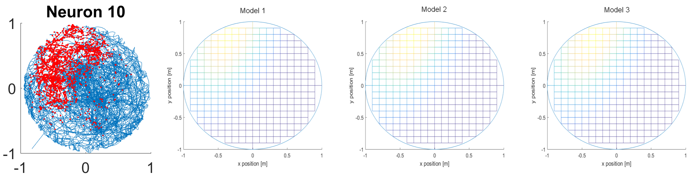

# Generalised linear modeling
EN.580.439 Models of the Neuron

## Model details
- Constructed 3 GLMs after initial classification of cells into 3 groups based on their spatial and temporal firing patterns
- A data-driven approach was used in determination of each model's covariates
- All GLMs have all positional covariates
- Each GLM has their own velocity, speed and direction covariates
- Each GLM has their own history dependence

**Model 1**

**Model 2**

**Model 3**

## Conclusions 
- Model 3 performed slightly better when comparing relative goodness-of-fit due to low number of covariates
- However, all three models are very similar
- Positional covariates had the most explanatory power
- All the neurons showed some history dependence between 5-20 ms in the past as well as around 90-140 ms
